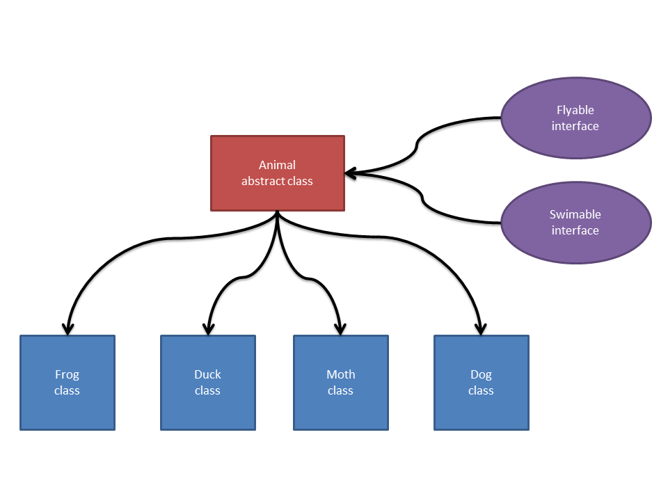

# Animal

## Tasks

1. Create a class called Animal, which should contain at least 2 methods and 3 variables of your choosing.

2. Create 4 more classes, each with their own methods and variables, which also inherit from Animal.
	HINT: Ensure that your inheritance hierarchy makes sense.

3. Create 2 interfaces, each containing one method, which can be implemented across your hierarchy.
	HINT: your interfaces should be implemented at the highest possible level of your hierarchy.

4. Draw a diagram to explain your class hierarchy.

## extended

* you've implemented flyable and swimable across the top of animal, but what if we had a Penguin class? or a FlyingFish?

* there's only two 'layers' of the hierarchy - Animal and each of the four other classes. what if we had Mammal or Crustacean?

* what if each animal also had their own functionality other than what was inherited from the base class Animal?